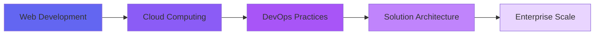

# 👋 Welcome to My Digital Universe

<div align="center">
  
  

</div>

---

## 🎯 About Me

I'm **Rishabh Nigam** – a passionate technologist who bridges the gap between elegant code and robust cloud infrastructure. With a keen eye for design and a deep understanding of cloud architecture, I craft solutions that are not just functional, but exceptional.

```yaml
current_focus:
  - Architecting scalable cloud solutions on AWS & Azure
  - Building full-stack applications with modern frameworks
  - Mastering DevOps practices and CI/CD pipelines
  - Exploring containerization with Docker & Kubernetes

specialization:
  development: ["React.js", "Node.js", "JavaScript", "TypeScript"]
  cloud: ["AWS", "Azure", "Terraform", "CloudFormation"]
  devops: ["Docker", "Kubernetes", "Jenkins", "GitHub Actions"]
  databases: ["MongoDB", "MySQL", "PostgreSQL", "DynamoDB"]
```

---

## 🛠️ Technology Arsenal

### **Frontend Mastery**


### **Backend Excellence**


### **Cloud & Infrastructure**


### **DevOps & Tools**


### **Databases**


---

## 🚀 Featured Projects

### 🌐 **Full-Stack Development**

#### 📝 **Note Making Application** `In Progress`
> A modern, feature-rich note-taking application with cloud sync capabilities
- **Tech Stack:** React.js, Node.js, MongoDB, AWS S3
- **Features:** Real-time sync, Rich text editor, Tag system, Cloud backup
- **Status:** 🔨 Currently under development

#### 🎮 **Corporate Quiz Game**
> Interactive TypeScript-based quiz platform for corporate training
- **Tech Stack:** TypeScript, React, Node.js
- **Features:** Real-time scoring, Admin dashboard, Analytics
- 🔗 [View Repository](https://github.com/anilkr29)

#### 🌤️ **Weather Application**
> Real-time weather tracking with beautiful UI and forecast features
- **Tech Stack:** JavaScript, React, OpenWeather API
- **Features:** 7-day forecast, Location-based weather, Responsive design

#### 🎯 **BMI Calculator**
> Health-focused BMI calculator with personalized recommendations
- **Tech Stack:** JavaScript, HTML5, CSS3
- **Features:** BMI tracking, Health insights, Progress charts

#### 🎨 **Portfolio Website**
> Premium personal portfolio showcasing projects and skills
- **Tech Stack:** HTML, CSS, JavaScript
- **Features:** Smooth animations, Responsive, Dark mode

### ☁️ **Cloud & DevOps Projects**

#### 🐳 **Jenkins Docker Pipeline**
> Automated CI/CD pipeline using Jenkins and Docker
- **Tech Stack:** Jenkins, Docker, GitHub Actions
- **Features:** Automated builds, Container orchestration, Multi-stage deployment

#### 📊 **Netflix SQL Analysis**
> Data analysis project exploring Netflix content patterns
- **Tech Stack:** SQL, PostgreSQL, Python
- **Features:** Advanced queries, Data visualization, Insights generation

#### 🛒 **Retail Sales SQL Project**
> Comprehensive retail analytics using SQL
- **Tech Stack:** SQL, MySQL
- **Features:** Sales trends, Customer analytics, Inventory insights

#### 🔄 **CI/CD Pipeline Project**
> Enterprise-grade continuous integration and deployment pipeline
- **Tech Stack:** Jenkins, Docker, Kubernetes, AWS
- **Features:** Automated testing, Blue-green deployment, Rollback capabilities

#### ⚙️ **Dabur Workspace Optimizer**
> JavaScript-based workspace optimization tool
- **Tech Stack:** JavaScript, Node.js
- **Features:** Resource allocation, Performance monitoring

---

## 📊 GitHub Analytics

<div align="center">
  
  
  
  
  
  

</div>

---

## 🎓 Certifications & Learning Path



- 🎯 **AWS Solutions Architect** - In Progress
- 📚 **Microsoft Azure Fundamentals** - Completed
- 🔧 **Docker & Kubernetes** - Certified
- 💻 **Full Stack Development** - Professional

---

## 💼 Professional Highlights

<table>
  <tr>
    <td align="center" width="50%">
      
      <br />
      <b>Full-Stack Development</b>
      <br />
      Building responsive, scalable web applications with modern frameworks and best practices
    </td>
    <td align="center" width="50%">
      
      <br />
      <b>Cloud Architecture</b>
      <br />
      Designing and implementing cloud-native solutions on AWS and Azure platforms
    </td>
  </tr>
  <tr>
    <td align="center" width="50%">
      
      <br />
      <b>DevOps Engineering</b>
      <br />
      Automating deployment pipelines and infrastructure with CI/CD best practices
    </td>
    <td align="center" width="50%">
      
      <br />
      <b>Database Design</b>
      <br />
      Architecting efficient database schemas for SQL and NoSQL databases
    </td>
  </tr>
</table>

---

## 🌱 Current Focus

```javascript
const currentGoals = {
  learning: [
    "Advanced Kubernetes orchestration",
    "Serverless architectures with AWS Lambda",
    "Microservices design patterns",
    "Infrastructure as Code with Terraform"
  ],
  building: [
    "Note Making Application with cloud sync",
    "Enterprise CI/CD pipeline templates",
    "Cloud cost optimization tools"
  ],
  exploring: [
    "AI/ML integration in cloud applications",
    "Edge computing solutions",
    "Multi-cloud strategies"
  ]
};
```

---

## 📈 Contribution Graph

<div align="center">
  
  

</div>

---

## 🤝 Let's Connect

<div align="center">

[](https://linkedin.com/in/rishabh-nigam-68b964241)
[](https://github.com/restructrishi)
[](mailto:rishabh.ngm11@gmail.com)
[](https://your-portfolio.com)

</div>

---


<div align="center">
  
  **Building the future, one commit at a time** 🚀
  
  
  
</div>

---

<div align="center">
  
</div>
